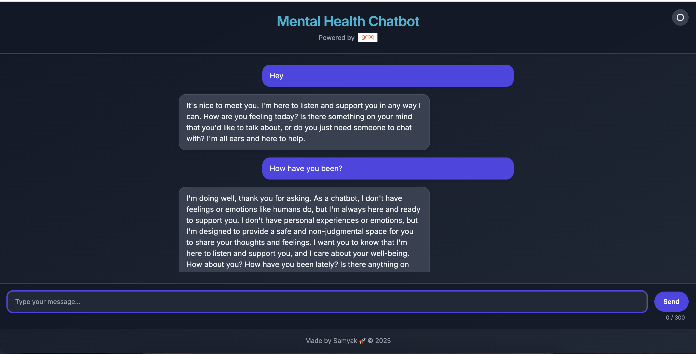

# 🧠 Mental Health Chatbot

A beautifully designed, AI-powered mental health chatbot web app aimed at offering emotional support through safe and empathetic conversations. Built with a modern tech stack and responsive interface, this chatbot encourages users to engage in thoughtful conversations in a comfortable environment.

---

## ✨ Features

- 🎨 Clean and Responsive UI using Tailwind CSS
- 🌙 Dark Mode Toggle for better accessibility
- 💬 Chat interface with smooth animations
- ✍️ Character limit counter (Max 300 characters)
- 🚫 Profanity filtering using an open-source bad words list
- 📩 Scroll-to-bottom button for longer chat sessions
- ⚡ Seamless integration with a backend chatbot API (GROQ-powered)

---

## 🔧 Technologies Used

- **Frontend**: HTML, CSS, JavaScript
- **Styling**: Tailwind CSS, Custom CSS
- **Backend**: Flask (Python)
- **Hosting (API)**: Render.com

---
